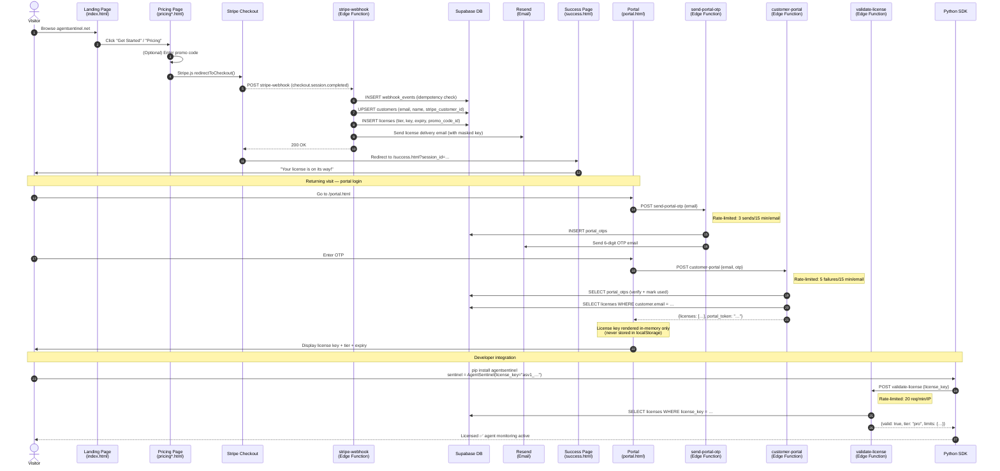

# AgentSentinel — Customer Journey

Complete data flow from anonymous visitor to a running SDK integration.

---

## End-to-End Flow Diagram



---

## Data Flow by Stage

### Stage 1 — Visitor Arrives

**Entry points:**
- `index.html` — main landing page
- `getting-started.html` — developer onboarding
- `docs.html` — documentation
- `security.html` — security overview

**No data collected** at this stage.

---

### Stage 2 — Pricing & Plan Selection

**Files:** [`pricing-team.html`](../pricing-team.html)

**Promo code flow (optional):**
1. Customer enters a promo code in the checkout form.
2. Frontend calls `POST /functions/v1/validate-promo` with `{code, tier}`.
3. Response: `{valid: true, type, value, description}` or `{valid: false, reason}`.
4. Valid promo → Stripe coupon ID applied to the `checkout.session.create()` call.
5. Discount reflected in Stripe Checkout UI.

**Rate limit:** 10 req/min per IP on `validate-promo`.

---

### Stage 3 — Stripe Checkout

Stripe handles all payment processing. AgentSentinel never handles raw card data.

**Metadata passed to Stripe:**
- `metadata.tier` — selected plan (`starter`, `pro`, `pro_team`, `enterprise`)
- `metadata.promo_code_id` — UUID of applied promo (if any)
- `client_reference_id` — internal reference

**Stripe events handled by `stripe-webhook`:**
| Event | Action |
|---|---|
| `checkout.session.completed` | Create customer + license, send email |
| `customer.subscription.updated` | Update license tier/expiry |
| `customer.subscription.deleted` | Mark license `cancelled` |
| `invoice.payment_failed` | Mark license `past_due` |
| `invoice.payment_succeeded` | Extend license expiry |

---

### Stage 4 — License Provisioning

**Edge Function:** [`stripe-webhook`](../supabase/functions/stripe-webhook/index.ts)

**Security:**
- Stripe webhook signature verified (`Stripe-Signature` header).
- Idempotency: `INSERT INTO webhook_events ON CONFLICT(stripe_event_id) DO NOTHING` — replays are discarded.
- License key generated with HMAC-SHA256 (`asv1_` prefix for signed keys).

**License key format** — see [`docs/license-key-format.md`](license-key-format.md).

**DB writes (in order):**
1. `webhook_events` — idempotency record
2. `customers` — UPSERT on `stripe_customer_id`
3. `licenses` — INSERT with tier, limits, expiry, `promo_code_id`
4. `admin_logs` — audit record for admin dashboard

**Email delivery via Resend:**
- License key is included in the email.
- Key is **masked in all server logs** (first 12 chars + `…`).
- Customer email is **never exposed to unauthenticated callers**.

---

### Stage 5 — Customer Portal

**File:** [`portal.html`](../portal.html)  
**Edge Functions:** [`send-portal-otp`](../supabase/functions/send-portal-otp/index.ts), [`customer-portal`](../supabase/functions/customer-portal/index.ts)

**OTP authentication flow:**
1. Customer enters email → `send-portal-otp` sends 6-digit code.
2. Customer enters OTP → `customer-portal` verifies + returns license data.
3. License key displayed **in-memory only** — never written to `localStorage` or `sessionStorage`.

**Privacy guarantees:**
- Response for unknown email is identical to known email (enumeration-resistant).
- OTP expires after 10 minutes.
- Rate limits: 3 sends + 5 verify failures per email per 15 minutes.

**Portal displays:**
- License key (masked by default, toggle to reveal)
- Tier and limits (`max_agents`, `max_events_per_month`)
- Expiry date and status
- Applied promo code (if any)
- Subscription management link (Stripe Customer Portal)

---

### Stage 6 — License Status Transitions

```
created ──► active ──► expired  (subscription end date passed)
                  └──► cancelled (subscription deleted)
                  └──► past_due  (payment failed)
                  └──► revoked   (admin action)
```

**Status sync:** Stripe webhooks drive all transitions. The admin dashboard (`licenses.js`) can also manually revoke a license.

---

### Stage 7 — SDK Integration

**Package:** `pip install agentsentinel` (Python)  
**TypeScript:** `npm install @agentsentinel/sdk`

**Validation flow:**
1. `AgentSentinel(license_key=…)` initialises the SDK.
2. SDK sends `POST /functions/v1/validate-license` with the license key.
3. Response includes `{valid, tier, limits, features}`.
4. If offline or rate-limited, SDK falls back to **HMAC offline verification** using `AGENTSENTINEL_LICENSE_SIGNING_SECRET`.

**Offline verification:** Available without network access. See [`docs/license-key-format.md`](license-key-format.md) for the HMAC payload specification.

**Rate limit:** 20 req/min per IP. Use the offline path for high-frequency validation.

---

## Key Security Properties

| Property | Implementation |
|---|---|
| License keys never in `localStorage` | Portal uses in-memory state only |
| Customer email not exposed to unauthenticated callers | `customer-portal` requires valid OTP |
| Admin API protected by Bearer token | `ADMIN_API_SECRET` — never in front-end HTML |
| Supabase service-role key in `sessionStorage` only | `auth.js` — clears on tab close |
| Webhook replay protection | `webhook_events(stripe_event_id)` unique constraint |
| OTP brute-force protection | 5 failures/15 min rate limit |
| License key logs masked | First 12 chars + `…` in all server logs |

---

## Related Documentation

- [HOSTING_GUIDE.md](HOSTING_GUIDE.md) — deployment architecture
- [SDK_INTEGRATION_CHECKLIST.md](SDK_INTEGRATION_CHECKLIST.md) — developer onboarding
- [PROMO_CODE_GUIDE.md](PROMO_CODE_GUIDE.md) — promo code admin workflow
- [TROUBLESHOOTING.md](TROUBLESHOOTING.md) — common issues and recovery
- [setup.md](setup.md) — environment variables and quick start
