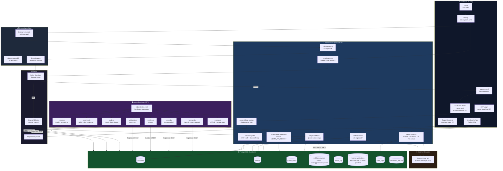
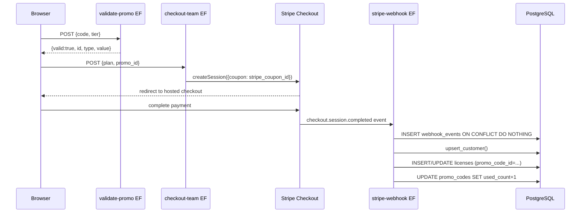
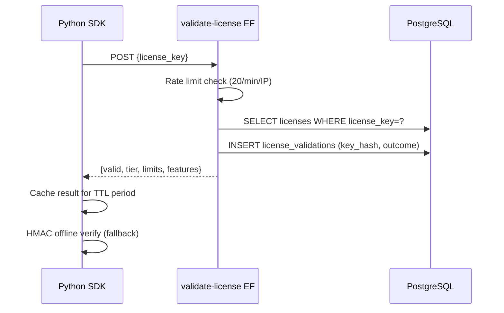

# AgentSentinel — System Architecture

**Audit Date:** 2026-05-05  
**Scope:** End-to-end flow from anonymous visitor through license activation to SDK runtime validation

---

## 1. End-to-End Architecture Diagram

---

## 2. Component Responsibilities

### 2.1 Customer-Facing HTML Pages

| File | Responsibility | Key Integrations |
|---|---|---|
| `index.html` | Marketing landing page, hero CTA | Links to `pricing-team.html` |
| `pricing-team.html` | Plan comparison, promo code entry, Stripe checkout initiation | `validate-promo` EF, `checkout-team` EF |
| `success.html` | Post-payment confirmation, portal redirect prompt | Session parameter parsing |
| `portal.html` | Customer self-service: license key display, billing management | `send-portal-otp` EF, `customer-portal` EF, `create-billing-session` EF |

### 2.2 Admin Dashboard SPA

The admin SPA lives at `python/agentsentinel/dashboard/static/admin/`. It is a single-page application with a client-side page router.

| Module | File | Responsibility |
|---|---|---|
| App router | `admin/index.html` + `app.js` | Page registry, lazy import, nav highlighting |
| Auth | `js/auth.js` | `sessionStorage` for service-role key + admin secret; URL in `localStorage` |
| API client | `js/api.js` | All Supabase REST calls; `_maskSensitive()` for audit logging |
| Overview | `js/pages/overview.js` | KPI cards, tier breakdown bar, recent activity |
| Licenses | `js/pages/licenses.js` | License search, status toggle, revocation, CSV export |
| Promos | `js/pages/promos.js` | Promo CRUD, usage chart, expiry management |
| Users | `js/pages/users.js` | Customer list, seat usage, merge/delete |
| Metrics | `js/pages/metrics.js` | Chart.js graphs for validations over time |
| Webhooks | `js/pages/webhooks.js` | Event log with `status` badge (`pending`/`processed`/`failed`) |
| System | `js/pages/system.js` | DB migration status, config display |
| Audit | `js/pages/audit.js` | `admin_logs` viewer with actor/IP/action |

**Auth strategy:** `agentsentinel-admin-key` (Supabase service-role key) and `agentsentinel-admin-secret` (admin API secret) stored in `sessionStorage` — cleared on tab close. Supabase URL stored in `localStorage` (non-sensitive). ✅

### 2.3 Python Server (`server.py`)

| Aspect | Implementation |
|---|---|
| Mode | Dev (HTTP, localhost) vs. Prod (configurable, HTTPS-terminated by reverse proxy) |
| CORS | `localhost` only in dev; configurable in prod |
| MIME types | Correct `.js` → `application/javascript`, `.css` → `text/css` |
| Static serving | Serves `static/admin/` with proper path traversal protection |

### 2.4 Supabase Edge Functions

| Function | Auth | Rate Limit | Purpose |
|---|---|---|---|
| `validate-license` | None (public) | 20/min/IP | Validates license key, returns tier + limits |
| `validate-promo` | None (public) | 10/min/IP | Validates promo code, returns discount value |
| `admin-generate-promo` | `Bearer ADMIN_API_SECRET` | None (admin-only) | Creates new promo code in DB |
| `stripe-webhook` | Stripe signature | None | Processes Stripe events, provisions licenses |
| `send-portal-otp` | None (public) | 3 sends + 5 verifies per email/15min | Sends OTP email via Resend |
| `customer-portal` | OTP token | Per-email | Verifies OTP, returns license key and customer data |
| `checkout-team` | None (public) | None | Creates Stripe checkout session |
| `create-billing-session` | OTP token | None | Creates Stripe billing portal session |

### 2.5 Database Tables

| Table | Purpose | Key Constraints |
|---|---|---|
| `customers` | Customer accounts | UNIQUE `email`; `upsert_customer()` function |
| `licenses` | License records | FK → `customers`, FK → `promo_codes` ON DELETE SET NULL |
| `promo_codes` | Promo code catalogue | UNIQUE `code`; CHECK `type IN (...)`, `used_count <= max_uses` |
| `webhook_events` | Stripe event log | UNIQUE `stripe_event_id`; `status` enum (pending/processed/failed) |
| `license_validations` | SDK validation audit | Stores SHA-256 hash of key only — never plaintext |
| `admin_logs` | Admin action audit | Actor, action, before/after JSON, masked sensitive fields |
| `portal_otps` | OTP state | UNIQUE `email`; expires_at TTL |
| `dashboard_metrics` | Cached KPI snapshots | Updated by webhook processor |

### 2.6 Python SDK (`python/agentsentinel/licensing.py`)

| Aspect | Implementation |
|---|---|
| Online validation | POST to `validate-license` EF; parses tier + limits |
| Offline validation | HMAC-SHA256 over alphabetically-sorted JSON payload |
| Key formats | `asv1_*` (HMAC-signed), `as_<tier>_*` (legacy) |
| Retry logic | Exponential backoff with jitter; falls back to cached result |
| Env vars | `AGENTSENTINEL_LICENSE_KEY`, `AGENTSENTINEL_API_URL` |

### 2.7 HMAC Signing Parity

Both the TypeScript Edge Function and the Python SDK sign license keys identically:

1. Build payload JSON with alphabetically-sorted keys: `exp`, `iat`, `nonce`, `tier`
2. Base64url-encode the JSON bytes
3. HMAC-SHA256 sign the base64url string using `LICENSE_SIGNING_KEY`
4. Key format: `asv1_<base64url_payload>.<hex_hmac>`

Python uses `sort_keys=True` in `json.dumps`; TypeScript uses a fixed replacer array `["exp","iat","nonce","tier"]`.

---

## 3. Data Flow: Promo Code → License Discount

---

## 4. Data Flow: SDK License Validation

